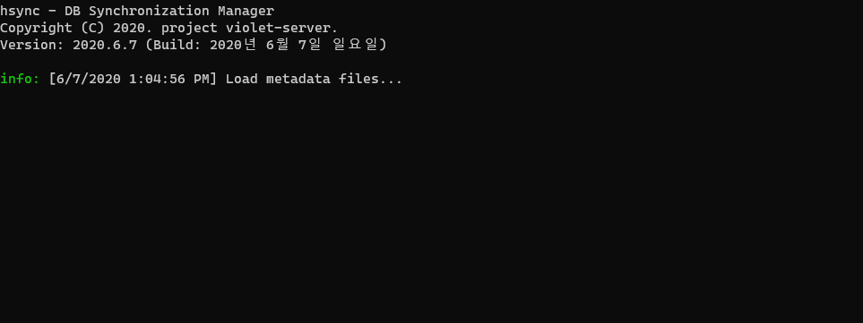

# Multi-thread Download Queue

[](https://www.nuget.org/packages/DownloadQueue/)



## Usage

### 1. Download Html

``` cs
static void Main(string[] args)
{
    var dq = new DownloadQueue.DownloadQueue();
    var html = dq.DownloadString("https://www.google.com/");
    Console.WriteLine(html);
    dq.Dispose();
}
```

### 2. Download File with Progress

``` cs
static void Main(string[] args)
{
    var dq = new DownloadQueue.DownloadQueue();
    var task = dq.MakeDefault("https://speed.hetzner.de/100MB.bin");
    task.StartCallback = () => Console.WriteLine("Download Start!");
    long total = 0;
    long current = 0;
    task.SizeCallback = (size) => { Console.WriteLine("Total File Size: " + size); total = size; };
    task.DownloadCallback = (size) => { current += size; Console.WriteLine("Receive: " + size + " " + (current / (double)total)); };
    task.Filename = "test";
    dq.DownloadFile(task);
    dq.Dispose();
}
```

### 3. Download Strings

``` cs
public List<string> DownloadStrings(List<string> urls, string cookie = "", Action complete = null, Action error = null)
{
    var interrupt = new ManualResetEvent(false);
    var result = new string[urls.Count];
    var count = urls.Count;
    int iter = 0;

    foreach (var url in urls)
    {
        var itertmp = iter;
        var task = MakeDefault(url);
        task.DownloadString = true;
        task.CompleteCallbackString = (str) =>
        {
            result[itertmp] = str;
            if (Interlocked.Decrement(ref count) == 0)
                interrupt.Set();
            complete?.Invoke();
        };
        task.ErrorCallback = (code, e) =>
        {
            if (Interlocked.Decrement(ref count) == 0)
                interrupt.Set();
            error?.Invoke();
        };
        task.Cookie = cookie;
        Scheduler.Add(task); // == dq.AppendTask(task);
        iter++;
    }

    interrupt.WaitOne();

    return result.ToList();
}
```

``` cs
static void Main(string[] args)
{
    using (var dq = new DownloadQueue.DownloadQueue())
    {
        var results = dq.DownloadStrings(Enumerable.Range(0, 65535).Select(x => $"http://127.0.0.1:80/?query={x}").ToList());
    }
}
```
